# Module 20
## Joint Savings Smart Contract in Solidity

 
---
> A Solidity smart contract that accepts two user addresses to automate the creation of joint savings accounts.
---

The goal of the program is to achieve following:
* Write Solidity JointSavings smart contract (Contract has functions such as setAccounts, deposit and withdraw)
* Compile the contract in Remix IDE and deploy the contract in Javascript VM
* Run contract to test deposit and withdraw features

---

## Technologies

> Program uses Remix IDE

> Program uses Solidity programming language (version 0.5.0)

---

## Installation Guide 

Please use online Remix IDE

---

## Usage

Go to:

> https://remix.ethereum.org/

---

## Results

> Compile the contract
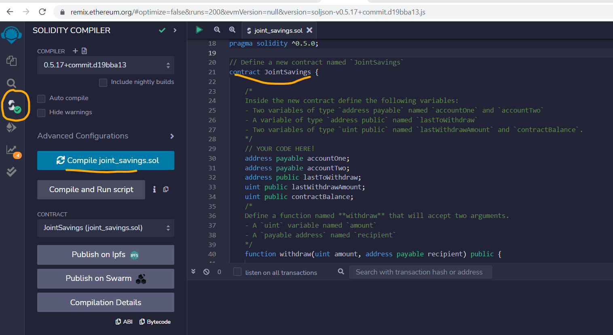

> Deploy the contract in JavaScript VM (same as Remix London VM)
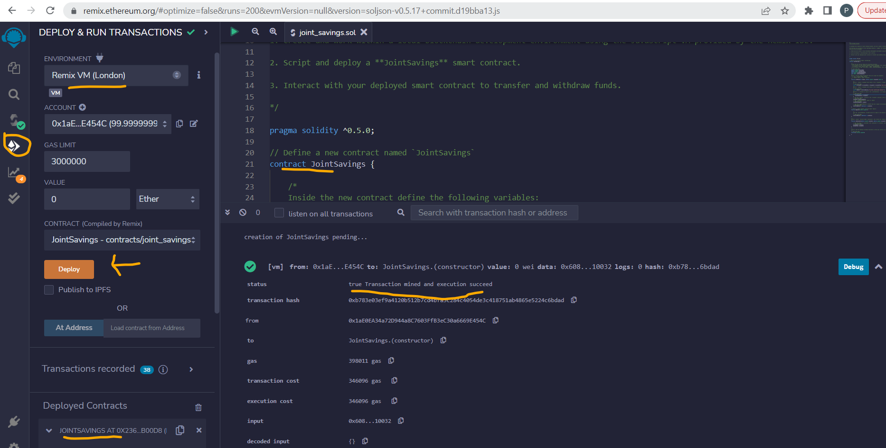

> After deployment, contract and associated functions can be seen as follows:
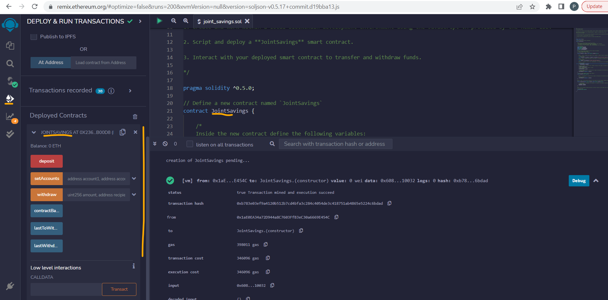

> Assign the accounts to JointSavings Contract (Account 1 address: 0x0c0669Cd5e60a6F4b8ce437E4a4A007093D368Cb; Account 2 address: 0x7A1f3dFAa0a4a19844B606CD6e91d693083B12c0)
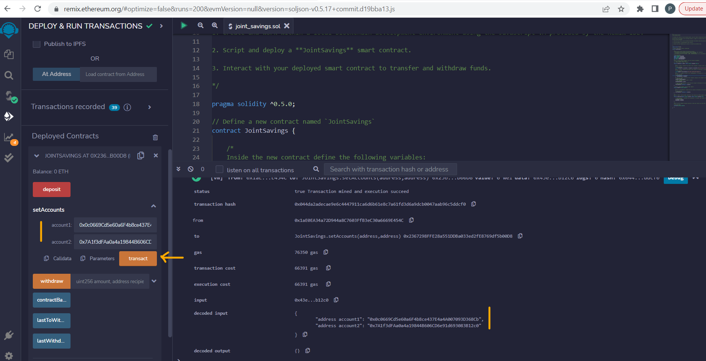

> Deposit 1 ETH (as 1000000000000000000 wei)
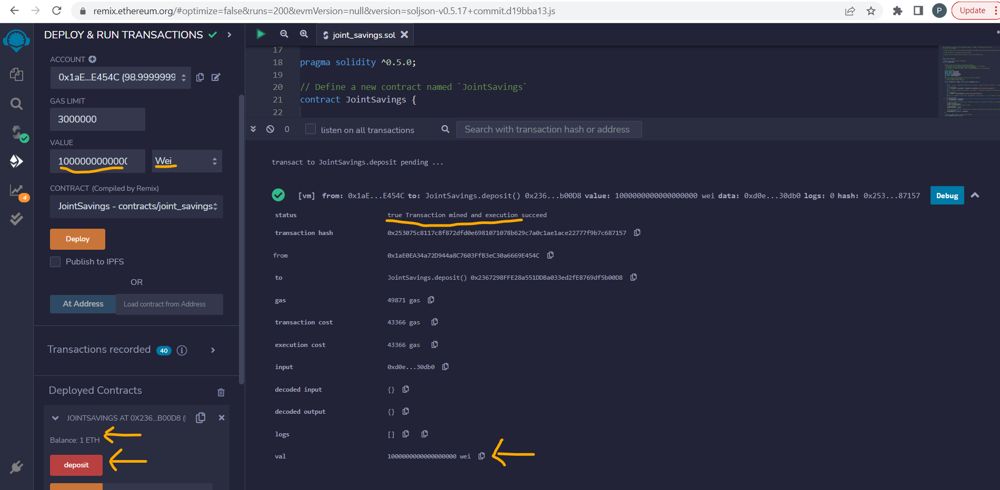
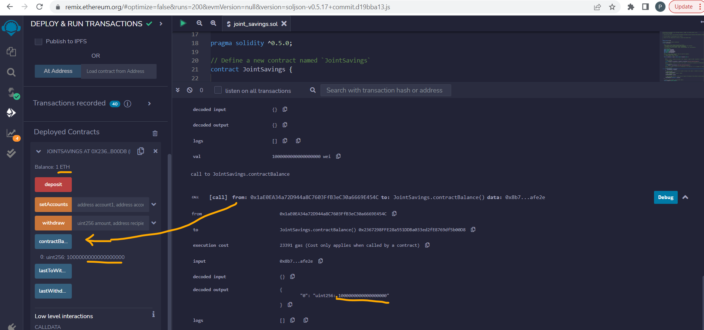

> Deposit 10 ETH (as 10000000000000000000 wei)
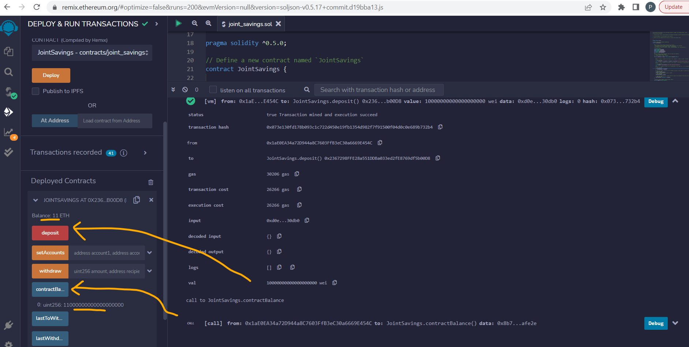

> Deposit 5 ETH (as 5 ether)
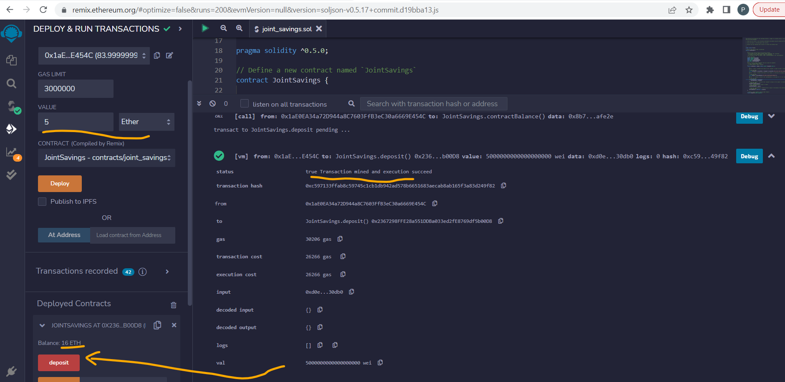
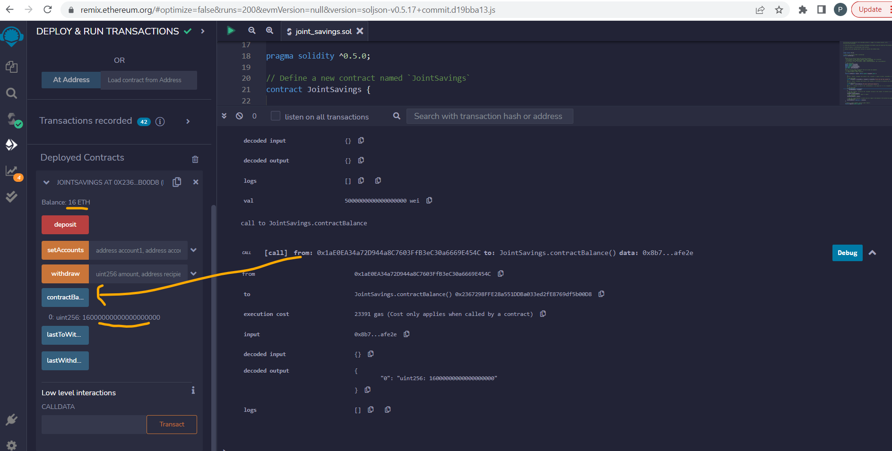

> After these 3 deposits balance of deploying party reduces by 16 (1+10+5 eth) eth and some gas fees. In this case from 100 ETH to 83.99x ETH.
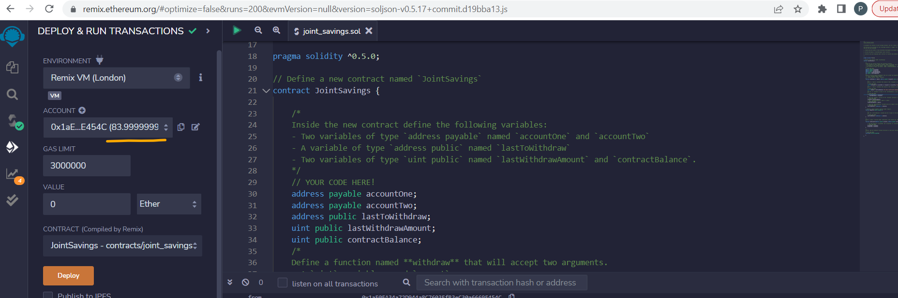

> LastToWithdraw address and amount are zero since no withdrawl is invoked till this point
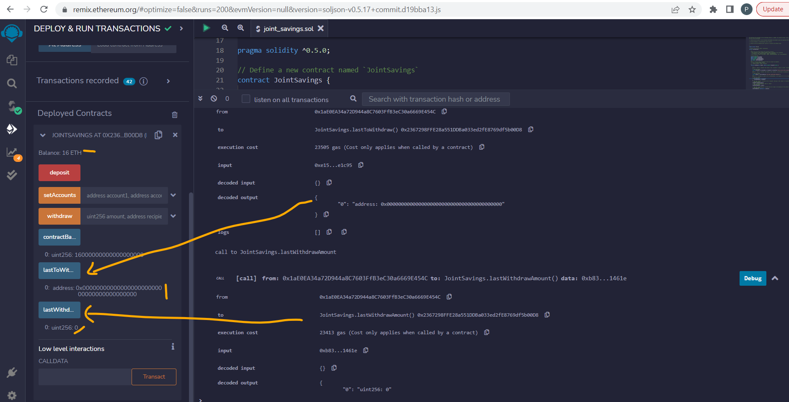

> Withdraw 5 ETH to account one (0x0c0669Cd5e60a6F4b8ce437E4a4A007093D368Cb)
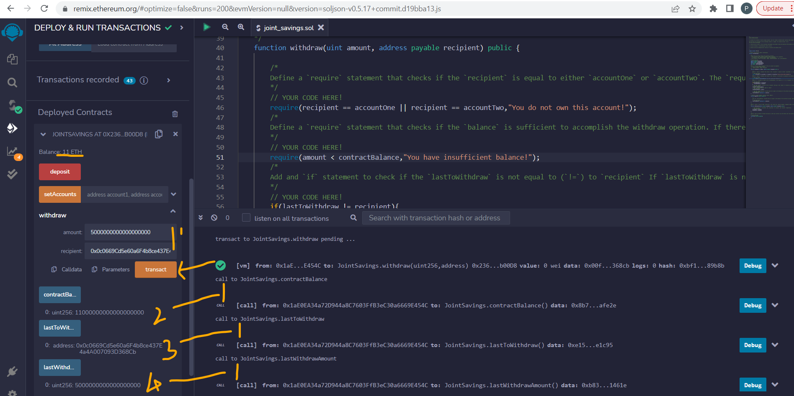
Last withdrawn address is updated to 0x0c0669Cd5e60a6F4b8ce437E4a4A007093D368Cb and last withdrawn amount to 5 ETH (i.e. 5*10^18 Wei)

> Withdraw 10 ETH to account two (0x7A1f3dFAa0a4a19844B606CD6e91d693083B12c0)
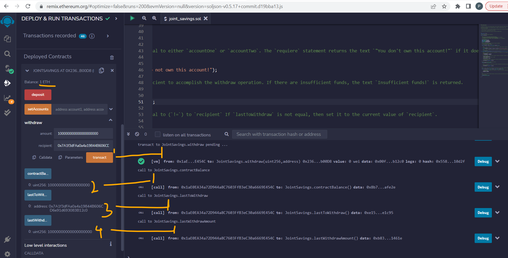
Last withdrawn address is updated to 0x7A1f3dFAa0a4a19844B606CD6e91d693083B12c0 and last withdrawn amount to 10 ETH (i.e. 10*10^18 Wei)
Also, after 2 withdrawls, contract balance is 1 ETH (=16 ETH - 5 ETH - 10 ETH)

> Results suggests a working contract has been deployed.

---

## Contributors

Main author is : Pravin Patil. His linkedin profile is [Profile](https://www.linkedin.com/in/pravin-patil-5880301)

---

## License

Open
